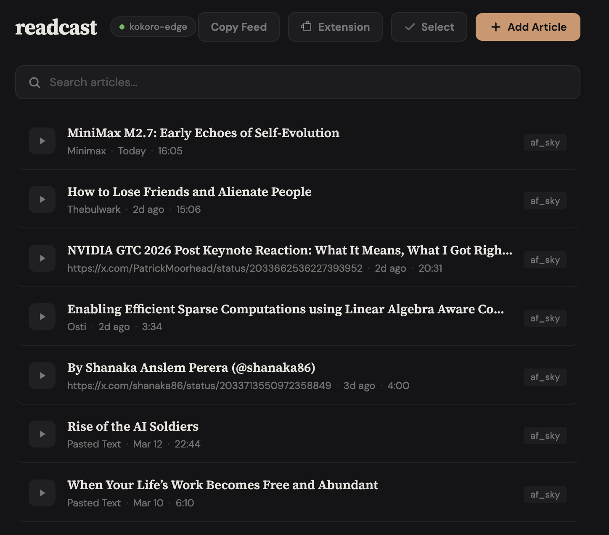

# readcast

A personal knowledge engine for your Mac.

`readcast` is a local-first knowledge engine that captures web articles, Twitter threads,
or pasted text — then makes them searchable by keyword and meaning, auto-tags them with
topics and entities, builds a knowledge graph, and generates audio podcasts. Everything
runs locally on Apple Silicon using MLX for embeddings and inference, `kokoro-edge` for
speech synthesis, and SQLite for storage. No cloud, no API keys, no data leaves your machine.



## Features

- **Hybrid search** — keyword (FTS5) and semantic (vector embeddings) search fused via
  Reciprocal Rank Fusion. Search "BLAS" and find articles about GPU linear algebra even
  if they never use that exact word.
- **Auto-tagging** — local LLM extracts topics, entities, relationships, summaries, and
  authors from every article on ingestion.
- **Knowledge graph** — entities (people, companies, technologies) and their relationships
  are extracted and linked across articles.
- **Audio podcasts** — turn any article into a narrated podcast via `kokoro-edge` TTS.
  Subscribe in your podcast app via RSS.
- **Listen tracking** — tracks when you've listened to an article (>80% completion).
- **Browser extension** — capture articles directly from Brave, Chrome, or Edge.
- **Backfill pipeline** — `readcast backfill` runs tagging, entity extraction, and
  embedding generation across your entire library.

## Install

```bash
pixi global install readcast -c https://conda.anaconda.org/gjennings -c conda-forge
readcast web
```

That's it. This installs readcast, `kokoro-edge` (TTS engine), Python, ffmpeg, and all
dependencies in an isolated environment. The web UI launches at `http://127.0.0.1:8765`.

ML models (~600MB for embeddings + TTS) download automatically on first use.

### From source

```bash
git clone https://github.com/grej/readcast.git
cd readcast
pixi run start
```

`pixi run start` handles setup and launches the web UI.

### CLI usage

```bash
readcast add --process https://example.com/article
readcast list
readcast search "BLAS"
readcast backfill             # tags + entities + embeddings for all articles
readcast tags backfill        # auto-tag untagged articles
readcast embeddings backfill  # generate embeddings for un-embedded articles
```

If running from source, prefix commands with `pixi run readcast`.

## Browser extension

The browser extension captures articles while you browse. This is the one manual setup
step — browser security policies require loading extensions by hand.

**Setup** (Brave, Chrome, or Edge):

1. Go to `brave://extensions/` (or `chrome://extensions/`)
2. Enable **Developer mode**
3. Click **Load unpacked** → select the `extension/` directory in this repo
4. Make sure readcast is running (`readcast web`)

The extension adds:
- **Add Page** — sends the current page URL + rendered HTML to readcast
- **Add Selection** — sends highlighted text as a new article
- Right-click context menus for both actions

## Architecture

readcast stores everything in SQLite under `~/.readcast/`:

- **articles** — metadata, full text, TTS audio, tags, listen history
- **embeddings** — 384-dim vectors (bge-small-en-v1.5) for semantic search
- **entities / relationships** — knowledge graph extracted by local LLM
- **article_entities** — links articles to entities
- **concepts** — reserved for future extensions
- **agent_log** — audit trail of automated actions

Search uses hybrid Reciprocal Rank Fusion: FTS5 keyword results and cosine-similarity
vector results are merged with `score(d) = Σ 1/(k + rank(d))`, so both exact matches
and semantic matches surface without needing to normalize BM25 and cosine scores.

`kokoro-edge` runs as a local daemon on `localhost:7777`, providing an OpenAI-compatible
TTS API. readcast starts it automatically when needed.

## Status

`readcast` is early but usable:

- macOS 15+, Apple Silicon only
- localhost-only (all data stays on your machine)
- no cloud dependencies — TTS, embeddings, and LLM inference all run locally
- extensible schema — reserved columns and tables for future extensions

## Privacy and storage

All data lives locally under `~/.readcast/`:

- `config.toml` — configuration
- `index.db` — SQLite database with full-text search, embeddings, and knowledge graph
- `articles/{id}/` — extracted text, metadata, chunks, and audio
- `output/` — symlinks to generated audio files

Subscribe to your articles as a podcast by copying the feed URL from the web UI
or pointing your podcast app at `http://127.0.0.1:8765/feed.xml`.

## Development

```bash
git clone https://github.com/grej/readcast.git
cd readcast
pixi install          # installs Python, ffmpeg, nodejs, and all dependencies
pixi run test         # run tests
pixi run lint         # run linter
pixi run frontend:build  # rebuild React frontend
pixi run check        # all checks (lint + test + build)
```

See [CONTRIBUTING.md](CONTRIBUTING.md) for architecture and contributor workflow.
