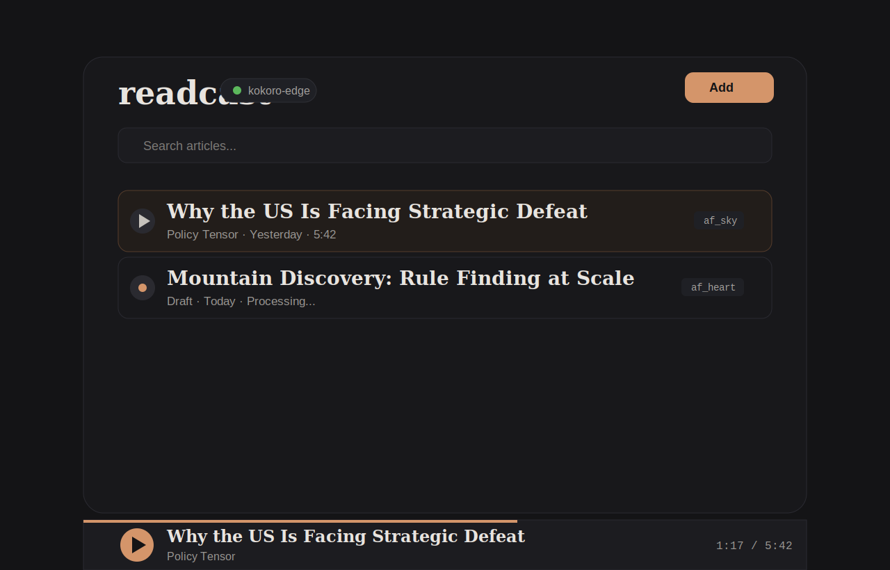

# readcast

Turn articles into podcasts on your Mac.

`readcast` is a local-first personal knowledge base and podcast system. Capture web
articles, Twitter threads, or pasted text from anywhere — search your collection by
keyword or meaning, and automatically generate audio podcasts. It runs on Apple Silicon,
uses `kokoro-edge` for speech synthesis, and keeps everything on your machine.



## Install

### One-line install (conda)

```bash
pixi global install readcast -c https://conda.anaconda.org/gjennings -c conda-forge
readcast web
```

This installs readcast and all dependencies (Python, ffmpeg, etc.) in an isolated
environment. You still need `kokoro-edge` for TTS — see below.

### From source

```bash
git clone https://github.com/gjennings/readcast.git
cd readcast
pixi run start
```

`pixi run start` handles setup and launches the web UI at `http://127.0.0.1:8765`.

### CLI usage

```bash
readcast add --process https://example.com/article
readcast add --process article.html
readcast add --process article.txt
readcast list
readcast search "strategic defeat"
```

If running from source, prefix commands with `pixi run readcast`.

## Browser extension

A Chromium extension (works in Brave, Chrome, Edge) lets you capture articles while
browsing:

1. Go to `brave://extensions/` (or `chrome://extensions/`)
2. Enable **Developer mode**
3. Click **Load unpacked** → select the `extension/` directory in this repo
4. Make sure readcast is running (`readcast web`)

The extension adds:
- **Add Page** — sends the current page URL + rendered HTML to readcast
- **Add Selection** — sends highlighted text as a new article
- Right-click context menus for both actions

## `kokoro-edge` dependency

`readcast` talks to the local `kokoro-edge` daemon for text-to-speech. It does not
bundle its own TTS runtime.

`readcast` checks for `kokoro-edge` in this order:

1. `READCAST_KOKORO_EDGE_BIN` environment variable
2. `PATH`
3. sibling dev build at `../kokoro-mlx/.build-xcode/stage/bin/kokoro-edge`
4. installer URL via `KOKORO_EDGE_INSTALL_URL`

## Status

`readcast` is early but usable:

- macOS 15+, Apple Silicon only
- localhost-only (all data stays on your machine)
- no cloud TTS, no hosted backend

## Privacy and storage

All data lives locally under `~/.readcast/`:

- `config.toml` — configuration
- `index.db` — SQLite database with full-text search
- `articles/{id}/` — extracted text, metadata, chunks, and audio
- `output/` — symlinks to generated audio files

Subscribe to your articles as a podcast by copying the feed URL from the web UI
or pointing your podcast app at `http://127.0.0.1:8765/feed.xml`.

## Development

```bash
pixi install          # installs Python, ffmpeg, nodejs, and all dependencies
pixi run test         # run tests
pixi run lint         # run linter
pixi run frontend:build  # rebuild React frontend
pixi run check        # all checks (lint + test + build)
```

See [CONTRIBUTING.md](CONTRIBUTING.md) for architecture and contributor workflow.
